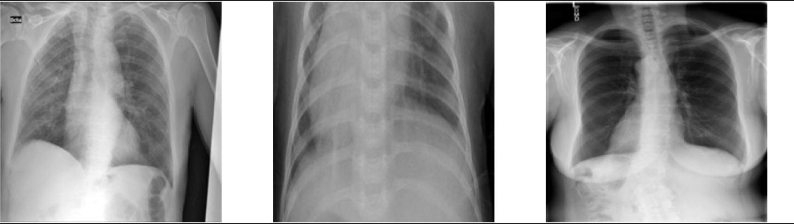
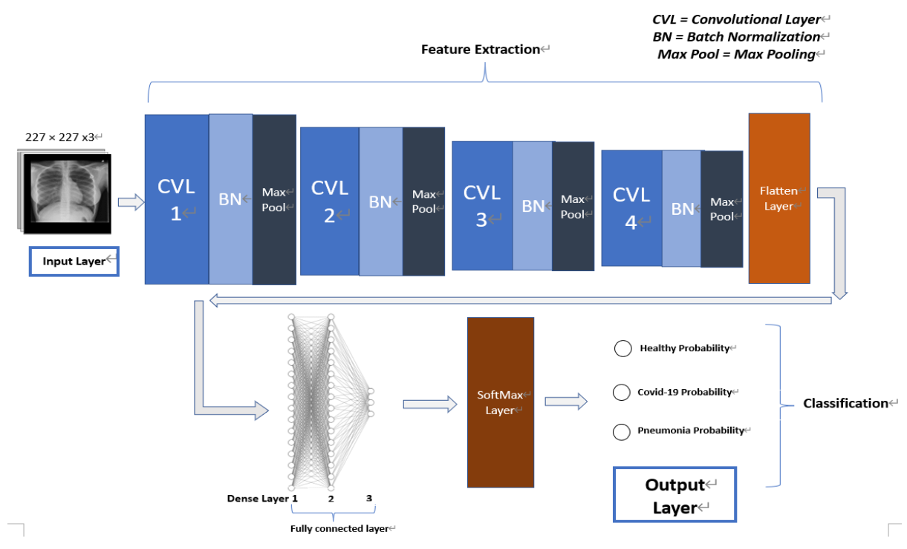
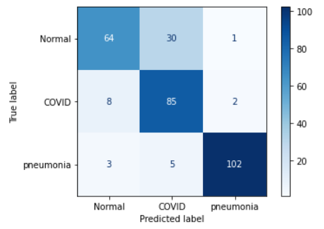
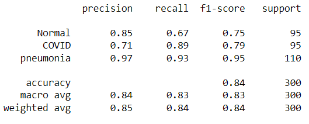
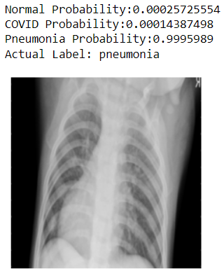
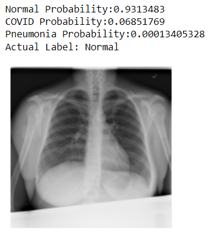
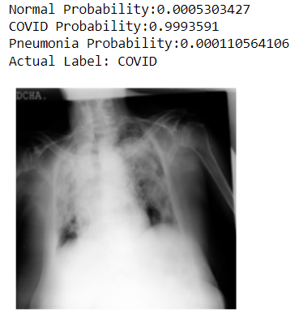

## COVID 19 X ray classification

**Description**
This project aims to develop an image-processing model
using AlexNet CNN model architecture that can help medical professionals classify patients
into COVID-19, Pneumonia, and normal cases based on their chest X-ray images.

Tensorflow with Keras library is used to train the AlexNet model, and the accuracy of the model achieved 84%,
while the F1 score of the mentioned 3 class achieved above 0.75

**Note**
If you want to try the code, could download the src file and the jupyter notebook, and run the code from step 5 (cause step 1-4 is some data preprocessing work)

**Data Source**
(https://www.kaggle.com/datasets/tawsifurrahman/covid19-radiography-database)
Below is some sample data from the dataset, they are labeled as "COVID", "pneumonia", and "normal" respectively

  

## Model Design

  

## Evaluation
**Confusion Matrix**

  

  

**Sample Output**

  

  

  

